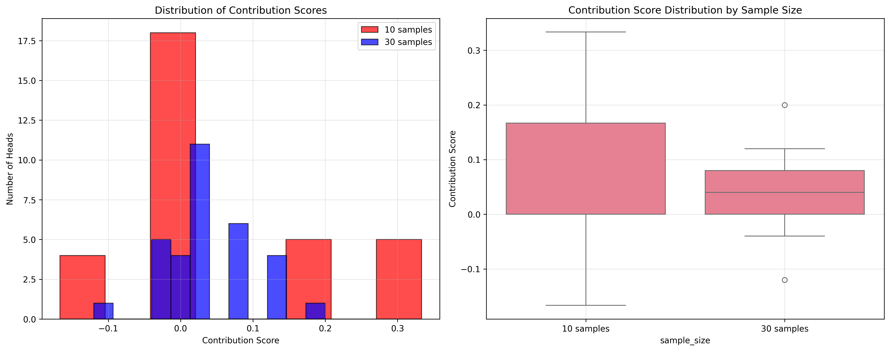
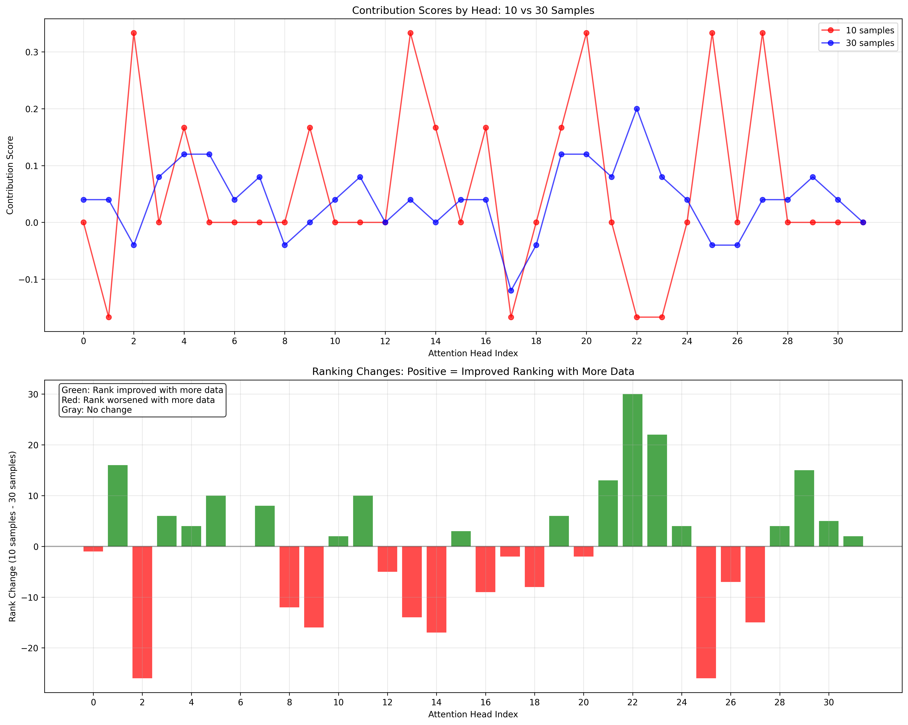

# Attention Head Perturbation Analysis

#### Distribution of Contribution Scores


## Methodology

### Core Concept
- **Hypothesis**: More important attention heads will cause larger performance drops when disrupted
- **Method**: Inject random noise into each attention head individually and measure impact
- **Evaluation**: Few-shot in-context learning on sentiment analysis task

### Technical Implementation

#### 1. Model Setup
- **Model**: Meta-Llama-3.2-1B (16 layers, 32 attention heads per layer)
- **Target**: Last layer (layer 15) attention heads
- **Task**: Sentiment analysis using IMDB dataset

#### 2. Intervention Mechanism

```python
class AttentionHeadNoiseHook:
    def __call__(self, module, input, output):
        # Reshape output to separate attention heads
        reshaped = output.view(batch_size, seq_len, num_heads, head_dim)
        
        # Add noise to target head only
        noise = torch.randn_like(reshaped[:, :, target_head, :]) * noise_scale
        reshaped[:, :, target_head, :] += noise
        
        # Reshape back
        output.data = reshaped.view(batch_size, seq_len, hidden_size)
```

#### 3. Hook Registration
- Uses PyTorch's `register_forward_hook()` on `model.layers[15].self_attn.o_proj`
- Hooks intercept attention output after projection
- Adds controlled noise (scale=2.0) to specific attention head dimensions

#### 4. Evaluation Process

**For each attention head (0-31):**
1. Register hook targeting specific head
2. Run few-shot evaluation on test samples
3. Calculate accuracy and F1 score
4. Remove hook
5. Compare with baseline performance

## Results Interpretation

### Performance Changes

**Positive Contribution Score** (Performance Drop):
- Head is **beneficial** for the task
- Disrupting it hurts model performance
- Higher positive scores = more important heads

**Negative Contribution Score** (Performance Improvement):
- Head is **harmful/irrelevant** for the task
- Disrupting it actually helps performance
- May focus on confusing or irrelevant features

**Zero Contribution Score**:
- Head has **neutral** impact
- No significant role in this specific task

Check results and run logs at the results directory.

#### Detailed Head-by-Head Analysis


### Impact Categories

- **HIGH**: >10% performance change (very important/harmful)
- **MEDIUM**: 5-10% performance change  
- **LOW**: <5% performance change